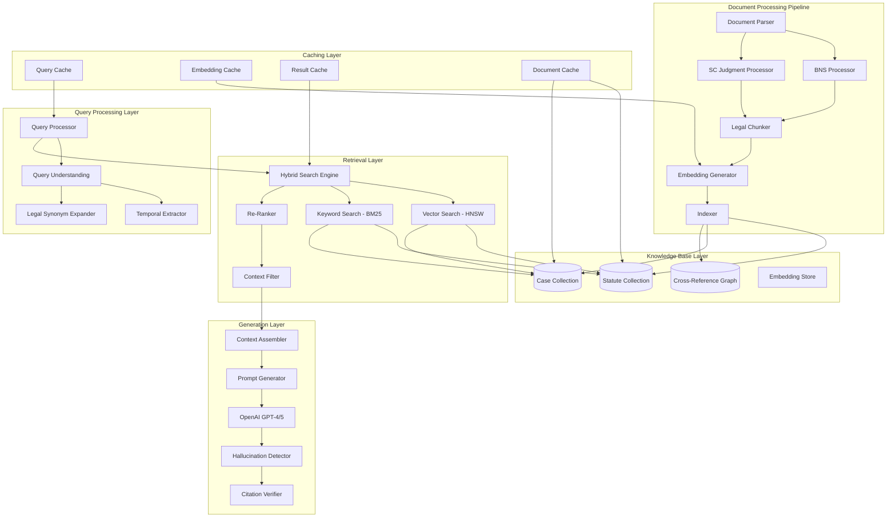

# Design Document - Advanced India Legal Knowledge Base & RAG System

## Overview

The Advanced India Legal Knowledge Base & RAG System is a production-grade, state-of-the-art AI system designed to provide accurate, low-latency answers grounded in Indian legal sources. The system processes the Bharatiya Nyaya Sanhita (BNS) Act 45 of 2023 and Supreme Court judgments (2020-2024) using sophisticated legal-aware chunking, hybrid search, and advanced retrieval-augmented generation techniques.

The architecture prioritizes accuracy through citation verification, temporal correctness through as-on date reasoning, and performance through intelligent caching and optimized retrieval pipelines. The system achieves sub-3-6 second response times while maintaining 95%+ accuracy for statute retrieval and 90%+ accuracy for case law retrieval.

## Architecture

### High-Level System Architecture



### Component Architecture

The system follows a layered architecture with clear separation of concerns:

1. **Query Processing Layer**: Understands user intent and legal context
2. **Retrieval Layer**: Performs hybrid search with legal-specific optimizations
3. **Knowledge Base Layer**: Stores processed legal documents with relationships
4. **Generation Layer**: Assembles context and generates verified responses
5. **Document Processing Pipeline**: Ingests and processes legal documents
6. **Caching Layer**: Optimizes performance through intelligent caching

## Components and Interfaces

### Query Processing Components

#### Query Understanding Service
```python
class QueryUnderstandingService:
    def __init__(self, legal_synonym_expander, temporal_extractor):
        self.synonym_expander = legal_synonym_expander
        self.temporal_extractor = temporal_extractor
    
    async def analyze_query(self, query: str) -> QueryAnalysis:
        """
        Analyzes user query to extract:
        - Temporal intent (as-on date)
        - Legal terminology and synonyms
        - Offense keywords and section guesses
        - Procedural stage indicators
        """
        temporal_context = await self.temporal_extractor.extract_date_intent(query)
        legal_terms = await self.synonym_expander.expand_legal_terms(query)
        section_guesses = await self._generate_section_guesses(query)
        
        return QueryAnalysis(
            original_query=query,
            temporal_context=temporal_context,
            expanded_terms=legal_terms,
            section_guesses=section_guesses,
            query_type=self._classify_query_type(query)
        )
```

#### Legal Synonym Expander
```python
class LegalSynonymExpander:
    def __init__(self):
        self.legal_synonyms = {
            "FIR": ["First Information Report", "police complaint", "initial report"],
            "cognizable": ["arrestable", "police powers", "without warrant"],
            "non-bailable": ["custody", "no bail", "detention"],
            "remand": ["custody", "detention", "judicial custody", "police custody"],
            "SLP": ["Special Leave Petition", "Supreme Court appeal"],
            "anticipatory": ["pre-arrest", "advance bail", "protection from arrest"],
            "locus": ["standing", "legal capacity", "right to sue"],
            "obiter": ["obiter dicta", "judicial observation", "non-binding"],
            "ratio": ["ratio decidendi", "binding principle", "legal principle"],
            "per incuriam": ["through lack of care", "oversight", "error"]
        }
    
    async def expand_legal_terms(self, query: str) -> Dict[str, List[str]]:
        """Expands legal terms with synonyms for comprehensive retrieval"""
        pass
```

### Retrieval Layer Components

#### Hybrid Search Engine
```python
class HybridSearchEngine:
    def __init__(self, vector_search, keyword_search, reranker):
        self.vector_search = vector_search
        self.keyword_search = keyword_search
        self.reranker = reranker
    
    async def search(self, query_analysis: QueryAnalysis, k_statutes=20, k_cases=50) -> SearchResults:
        """
        Performs hybrid search combining:
        - Dense vector similarity (ANN with HNSW)
        - Sparse keyword matching (BM25)
        - Legal-specific boosting and filtering
        """
        # Generate query embedding
        query_embedding = await self._get_query_embedding(query_analysis.expanded_query)
        
        # Parallel search execution
        statute_results = await self._search_statutes(query_embedding, query_analysis, k_statutes)
        case_results = await self._search_cases(query_embedding, query_analysis, k_cases)
        
        # Apply temporal filtering
        filtered_results = await self._apply_temporal_filter(
            statute_results + case_results, 
            query_analysis.temporal_context
        )
        
        # Re-rank with legal-specific scoring
        reranked_results = await self.reranker.rerank(
            filtered_results, 
            query_analysis,
            weights={"relevance": 0.6, "statute_edge": 0.25, "recency": 0.15}
        )
        
        # Apply MMR for diversity
        final_results = await self._apply_mmr(reranked_results, lambda_param=0.7)
        
        return SearchResults(
            statutes=final_results[:4],  # Top 4 statute chunks
            cases=final_results[4:8],    # Top 4 case chunks
            total_retrieved=len(filtered_results)
        )
```

#### Vector Search with HNSW
```python
class VectorSearchEngine:
    def __init__(self, pgvector_client):
        self.pgvector_client = pgvector_client
        self.hnsw_params = {
            "M": 16,
            "ef_construction": 200,
            "ef_search": 128
        }
    
    async def similarity_search(self, embedding: List[float], collection: str, k: int, filters: Dict) -> List[SearchResult]:
        """
        Performs ANN search using HNSW index with:
        - L2 normalized embeddings
        - Efficient similarity computation
        - Metadata filtering
        """
        query = """
        SELECT id, content, metadata, embedding <=> %s as distance
        FROM {collection}
        WHERE {filters}
        ORDER BY embedding <=> %s
        LIMIT %s
        """
        
        results = await self.pgvector_client.execute(
            query.format(collection=collection, filters=self._build_filter_clause(filters)),
            [embedding, embedding, k]
        )
        
        return [SearchResult.from_db_row(row) for row in results]
```

### Document Processing Pipeline

#### BNS Statute Processor
```python
class BNSStatuteProcessor:
    def __init__(self, text_extractor, legal_chunker):
        self.text_extractor = text_extractor
        self.legal_chunker = legal_chunker
    
    async def process_bns_pdf(self, pdf_path: str) -> List[StatuteChunk]:
        """
        Processes BNS PDF with legal-aware chunking:
        - Extracts text preserving structure
        - Identifies legal units (Section, Sub-section, Illustration, Explanation, Proviso)
        - Creates canonical IDs (BNS:2023:Sec:147)
        - Extracts cross-references
        """
        raw_text = await self.text_extractor.extract_pdf_text(pdf_path)
        
        # Parse legal structure
        sections = await self._parse_sections(raw_text)
        
        chunks = []
        for section in sections:
            # Create main section chunk
            section_chunk = StatuteChunk(
                id=f"BNS:2023:Sec:{section.number}",
                type="statute_section",
                act="BNS",
                year=2023,
                title=section.title,
                section=section.number,
                subunit="Section",
                text=section.text,
                effective_from="2024-07-01",
                effective_to=None,
                citations=await self._extract_cross_references(section.text),
                url="https://indiacode.nic.in/handle/123456789/15436",
                sha256=self._compute_hash(section.text)
            )
            chunks.append(section_chunk)
            
            # Process sub-units
            for sub_unit in section.sub_units:
                sub_chunk = StatuteChunk(
                    id=f"BNS:2023:Sec:{section.number}:Sub:{sub_unit.clause}",
                    type="statute_subsection",
                    act="BNS",
                    year=2023,
                    title=f"{section.title} - {sub_unit.type}",
                    section=section.number,
                    subunit=sub_unit.type,  # Illustration, Explanation, Proviso
                    text=sub_unit.text,
                    effective_from="2024-07-01",
                    effective_to=None,
                    citations=await self._extract_cross_references(sub_unit.text),
                    url="https://indiacode.nic.in/handle/123456789/15436",
                    sha256=self._compute_hash(sub_unit.text)
                )
                chunks.append(sub_chunk)
        
        return chunks
```

#### Supreme Court Judgment Processor
```python
class SupremeCourtJudgmentProcessor:
    def __init__(self, text_extractor, paragraph_detector, citation_extractor):
        self.text_extractor = text_extractor
        self.paragraph_detector = paragraph_detector
        self.citation_extractor = citation_extractor
    
    async def process_judgment_pdf(self, pdf_path: str, year: int) -> List[JudgmentChunk]:
        """
        Processes Supreme Court judgment with paragraph-level chunking:
        - Extracts text and metadata
        - Detects paragraph boundaries
        - Classifies sections (Facts, Issues, Analysis, Held, Order)
        - Extracts case and statute citations
        """
        raw_text = await self.text_extractor.extract_pdf_text(pdf_path)
        
        # Extract metadata
        metadata = await self._extract_judgment_metadata(raw_text)
        
        # Detect paragraphs
        paragraphs = await self.paragraph_detector.detect_paragraphs(raw_text)
        
        chunks = []
        for para in paragraphs:
            # Classify paragraph section
            section_type = await self._classify_paragraph_section(para.text, para.position)
            
            # Extract citations
            statute_refs = await self.citation_extractor.extract_statute_references(para.text)
            case_refs = await self.citation_extractor.extract_case_references(para.text)
            
            chunk = JudgmentChunk(
                id=f"SC:{year}:{metadata.neutral_citation}:Para:{para.number}",
                type="judgment_para",
                court="Supreme Court of India",
                decision_date=metadata.decision_date,
                bench=metadata.bench,
                case_title=metadata.case_title,
                citation_neutral=metadata.neutral_citation,
                scr_citation=metadata.scr_citation,
                para_no=str(para.number),
                section=section_type,
                text=para.text,
                statute_refs=statute_refs,
                case_refs=case_refs,
                url=f"https://main.sci.gov.in/supremecourt/2020/{pdf_path}",
                sha256=self._compute_hash(para.text)
            )
            chunks.append(chunk)
        
        return chunks
```

### Generation Layer Components

#### Context Assembler
```python
class ContextAssembler:
    def __init__(self, token_counter):
        self.token_counter = token_counter
        self.max_context_ratio = 0.75  # Reserve 25% for response
    
    async def assemble_context(self, search_results: SearchResults, model_window: int) -> AssembledContext:
        """
        Assembles context from search results:
        - Creates separate STATUTE and CASE blocks
        - Manages token limits efficiently
        - Inserts source IDs and quote span markers
        - Merges overlapping chunks
        """
        max_context_tokens = int(model_window * self.max_context_ratio)
        
        # Build statute block
        statute_block = await self._build_statute_block(search_results.statutes)
        
        # Build case block
        case_block = await self._build_case_block(search_results.cases)
        
        # Combine and manage token limits
        combined_context = f"STATUTES:\n{statute_block}\n\nCASES:\n{case_block}"
        
        if self.token_counter.count_tokens(combined_context) > max_context_tokens:
            combined_context = await self._truncate_context(combined_context, max_context_tokens)
        
        return AssembledContext(
            statute_block=statute_block,
            case_block=case_block,
            combined_context=combined_context,
            source_ids=search_results.get_all_source_ids(),
            token_count=self.token_counter.count_tokens(combined_context)
        )
```

#### Hallucination Detector
```python
class HallucinationDetector:
    def __init__(self, citation_verifier):
        self.citation_verifier = citation_verifier
    
    async def verify_response(self, response: str, context: AssembledContext) -> VerificationResult:
        """
        Verifies AI response against retrieved sources:
        - Checks each factual claim has source support
        - Verifies quoted text matches source exactly
        - Validates citation IDs exist in knowledge base
        - Flags unsupported claims
        """
        claims = await self._extract_factual_claims(response)
        citations = await self._extract_citations(response)
        quotes = await self._extract_quotes(response)
        
        verification_results = []
        
        # Verify each claim
        for claim in claims:
            is_supported = await self._verify_claim_support(claim, context)
            verification_results.append(ClaimVerification(
                claim=claim,
                is_supported=is_supported,
                supporting_sources=await self._find_supporting_sources(claim, context)
            ))
        
        # Verify citations
        citation_results = []
        for citation in citations:
            exists = await self.citation_verifier.verify_citation_exists(citation.id)
            citation_results.append(CitationVerification(
                citation_id=citation.id,
                exists=exists,
                accessible=await self._verify_citation_accessible(citation.id)
            ))
        
        # Verify quotes
        quote_results = []
        for quote in quotes:
            matches = await self._verify_quote_match(quote, context)
            quote_results.append(QuoteVerification(
                quote_text=quote.text,
                source_id=quote.source_id,
                exact_match=matches
            ))
        
        return VerificationResult(
            claim_verifications=verification_results,
            citation_verifications=citation_results,
            quote_verifications=quote_results,
            overall_confidence=self._calculate_confidence(verification_results)
        )
```

## Data Models

### Core Data Structures

#### Statute Chunk Model
```python
@dataclass
class StatuteChunk:
    id: str  # BNS:2023:Sec:147
    type: str  # statute_section, statute_subsection
    act: str  # BNS
    year: int  # 2023
    title: str  # Robbery
    section: str  # 147
    subunit: str  # Section|Sub|Illustration|Explanation|Proviso
    text: str  # Verbatim legal text
    effective_from: str  # 2024-07-01
    effective_to: Optional[str]  # None for current law
    citations: List[str]  # Cross-referenced sections
    url: str  # Authentic source URL
    sha256: str  # Content hash
    embedding: List[float]  # 1536-dim vector
    token_count: int
    created_at: datetime
```

#### Judgment Chunk Model
```python
@dataclass
class JudgmentChunk:
    id: str  # SC:2020:CriminalAppeal1234:Para:123
    type: str  # judgment_para
    court: str  # Supreme Court of India
    decision_date: str  # 2020-08-24
    bench: List[str]  # [Justice A, Justice B]
    case_title: str  # X v. State of Y
    citation_neutral: str  # 2020 SCC OnLine SC 1234
    scr_citation: Optional[str]  # 2020 SCR (3) 456
    para_no: str  # 123
    section: str  # Analysis|Facts|Issue|Held|Order
    text: str  # Verbatim paragraph text
    statute_refs: List[str]  # Referenced statute sections
    case_refs: List[str]  # Referenced cases
    url: str  # PDF source URL
    sha256: str  # Content hash
    embedding: List[float]  # 1536-dim vector
    token_count: int
    created_at: datetime
```

#### Cross-Reference Graph Model
```python
@dataclass
class CrossReference:
    src_id: str  # Source document ID
    dst_id: str  # Target document ID
    rel_type: str  # statute_to_statute, judgment_to_statute, judgment_to_judgment
    weight: float  # Relationship strength (0.0-1.0)
    context: str  # Surrounding text context
    created_at: datetime

class CrossReferenceGraph:
    def __init__(self):
        self.edges: Dict[str, List[CrossReference]] = {}
    
    def add_edge(self, edge: CrossReference):
        """Add bidirectional edge to graph"""
        if edge.src_id not in self.edges:
            self.edges[edge.src_id] = []
        self.edges[edge.src_id].append(edge)
    
    def get_related_documents(self, doc_id: str, max_depth: int = 2) -> List[str]:
        """Get related documents within max_depth hops"""
        pass
```

### Database Schema

#### PostgreSQL with PGVector Extension
```sql
-- Enable PGVector extension
CREATE EXTENSION IF NOT EXISTS vector;

-- Statute chunks table
CREATE TABLE statute_chunks (
    id VARCHAR(100) PRIMARY KEY,
    type VARCHAR(50) NOT NULL,
    act VARCHAR(20) NOT NULL,
    year INTEGER NOT NULL,
    title VARCHAR(500) NOT NULL,
    section VARCHAR(20) NOT NULL,
    subunit VARCHAR(50) NOT NULL,
    text TEXT NOT NULL,
    effective_from DATE NOT NULL,
    effective_to DATE,
    citations JSONB DEFAULT '[]',
    url VARCHAR(500) NOT NULL,
    sha256 VARCHAR(64) NOT NULL,
    embedding vector(1536) NOT NULL,
    token_count INTEGER NOT NULL,
    created_at TIMESTAMP DEFAULT NOW()
);

-- Case chunks table
CREATE TABLE case_chunks (
    id VARCHAR(200) PRIMARY KEY,
    type VARCHAR(50) NOT NULL,
    court VARCHAR(100) NOT NULL,
    decision_date DATE NOT NULL,
    bench JSONB NOT NULL,
    case_title VARCHAR(500) NOT NULL,
    citation_neutral VARCHAR(100),
    scr_citation VARCHAR(100),
    para_no VARCHAR(10) NOT NULL,
    section VARCHAR(50) NOT NULL,
    text TEXT NOT NULL,
    statute_refs JSONB DEFAULT '[]',
    case_refs JSONB DEFAULT '[]',
    url VARCHAR(500) NOT NULL,
    sha256 VARCHAR(64) NOT NULL,
    embedding vector(1536) NOT NULL,
    token_count INTEGER NOT NULL,
    created_at TIMESTAMP DEFAULT NOW()
);

-- Cross-reference graph table
CREATE TABLE cross_references (
    id UUID PRIMARY KEY DEFAULT gen_random_uuid(),
    src_id VARCHAR(200) NOT NULL,
    dst_id VARCHAR(200) NOT NULL,
    rel_type VARCHAR(50) NOT NULL,
    weight FLOAT NOT NULL DEFAULT 1.0,
    context TEXT,
    created_at TIMESTAMP DEFAULT NOW()
);

-- HNSW indexes for vector similarity search
CREATE INDEX statute_chunks_embedding_idx ON statute_chunks 
USING hnsw (embedding vector_cosine_ops) 
WITH (m = 16, ef_construction = 200);

CREATE INDEX case_chunks_embedding_idx ON case_chunks 
USING hnsw (embedding vector_cosine_ops) 
WITH (m = 16, ef_construction = 200);

-- Additional indexes for filtering
CREATE INDEX statute_chunks_section_idx ON statute_chunks (act, section);
CREATE INDEX statute_chunks_temporal_idx ON statute_chunks (effective_from, effective_to);
CREATE INDEX case_chunks_date_idx ON case_chunks (decision_date);
CREATE INDEX case_chunks_court_idx ON case_chunks (court);
CREATE INDEX cross_references_src_idx ON cross_references (src_id);
CREATE INDEX cross_references_dst_idx ON cross_references (dst_id);

-- Full-text search indexes for BM25
CREATE INDEX statute_chunks_text_idx ON statute_chunks USING gin(to_tsvector('english', text));
CREATE INDEX case_chunks_text_idx ON case_chunks USING gin(to_tsvector('english', text));
```

## Error Handling

### Error Classification and Recovery Strategies

#### Retrieval Errors
```python
class RetrievalError(Exception):
    """Base class for retrieval-related errors"""
    pass

class InsufficientResultsError(RetrievalError):
    """Raised when retrieval returns too few relevant results"""
    def __init__(self, query: str, results_count: int, minimum_required: int):
        self.query = query
        self.results_count = results_count
        self.minimum_required = minimum_required
        super().__init__(f"Query '{query}' returned {results_count} results, minimum {minimum_required} required")

class TemporalFilterError(RetrievalError):
    """Raised when temporal filtering eliminates all results"""
    def __init__(self, as_on_date: str, total_before_filter: int):
        self.as_on_date = as_on_date
        self.total_before_filter = total_before_filter
        super().__init__(f"Temporal filter for date {as_on_date} eliminated all {total_before_filter} results")
```

#### Generation Errors
```python
class GenerationError(Exception):
    """Base class for generation-related errors"""
    pass

class HallucinationDetectedError(GenerationError):
    """Raised when hallucination detector flags response"""
    def __init__(self, unsupported_claims: List[str]):
        self.unsupported_claims = unsupported_claims
        super().__init__(f"Detected {len(unsupported_claims)} unsupported claims")

class CitationVerificationError(GenerationError):
    """Raised when citation verification fails"""
    def __init__(self, invalid_citations: List[str]):
        self.invalid_citations = invalid_citations
        super().__init__(f"Found {len(invalid_citations)} invalid citations")
```

#### Error Recovery Patterns
```python
class ErrorRecoveryService:
    def __init__(self, max_retries: int = 2):
        self.max_retries = max_retries
    
    async def handle_insufficient_results(self, error: InsufficientResultsError) -> RecoveryAction:
        """
        Recovery strategies for insufficient results:
        1. Expand search with relaxed filters
        2. Increase k parameter
        3. Use broader synonym expansion
        4. Ask clarifying question
        """
        if error.results_count == 0:
            return RecoveryAction.ASK_CLARIFYING_QUESTION
        elif error.results_count < error.minimum_required // 2:
            return RecoveryAction.EXPAND_SEARCH_PARAMETERS
        else:
            return RecoveryAction.PROCEED_WITH_AVAILABLE_RESULTS
    
    async def handle_hallucination_detected(self, error: HallucinationDetectedError) -> RecoveryAction:
        """
        Recovery strategies for hallucination:
        1. Retry with lower temperature
        2. Expand context with more sources
        3. Remove unsupported claims
        4. Return insufficient information message
        """
        if len(error.unsupported_claims) <= 2:
            return RecoveryAction.REMOVE_UNSUPPORTED_CLAIMS
        else:
            return RecoveryAction.RETURN_INSUFFICIENT_INFO
```

## Testing Strategy

### Unit Testing Framework

#### Legal Chunking Tests
```python
class TestBNSProcessor:
    def test_section_boundary_detection(self):
        """Test that BNS sections are correctly identified and chunked"""
        sample_text = """
        Section 147. Robbery
        Whoever, except in the case provided for in section 146, voluntarily causes hurt...
        
        Illustration
        A holds Z down, and fraudulently takes Z's money and jewellery from Z's clothes...
        """
        
        processor = BNSStatuteProcessor()
        chunks = processor.process_text(sample_text)
        
        assert len(chunks) == 2  # Section + Illustration
        assert chunks[0].id == "BNS:2023:Sec:147"
        assert chunks[1].id == "BNS:2023:Sec:147:Illustration:1"
        assert chunks[0].subunit == "Section"
        assert chunks[1].subunit == "Illustration"

    def test_cross_reference_extraction(self):
        """Test extraction of section cross-references"""
        text = "Whoever, except in the case provided for in section 146, commits robbery..."
        
        processor = BNSStatuteProcessor()
        citations = processor.extract_cross_references(text)
        
        assert "BNS:2023:Sec:146" in citations
```

#### Hybrid Search Tests
```python
class TestHybridSearch:
    def test_vector_similarity_search(self):
        """Test vector similarity search returns relevant results"""
        query = "What is the punishment for robbery?"
        search_engine = HybridSearchEngine()
        
        results = search_engine.vector_search(query, collection="statute_chunks", k=5)
        
        # Should find BNS Section 147 (Robbery)
        assert any("BNS:2023:Sec:147" in result.id for result in results)
        assert all(result.similarity_score > 0.7 for result in results[:3])

    def test_temporal_filtering(self):
        """Test that temporal filtering works correctly"""
        query_analysis = QueryAnalysis(
            original_query="What was the law on robbery in 2023?",
            temporal_context=TemporalContext(as_on_date="2023-12-31")
        )
        
        search_engine = HybridSearchEngine()
        results = search_engine.search(query_analysis)
        
        # Should exclude BNS (effective 2024-07-01) and include IPC
        assert not any("BNS:2023" in result.id for result in results.statutes)
        assert any("IPC:1860" in result.id for result in results.statutes)
```

### Integration Testing

#### End-to-End RAG Pipeline Test
```python
class TestRAGPipeline:
    async def test_complete_rag_workflow(self):
        """Test complete RAG workflow from query to verified response"""
        query = "What is the punishment for robbery under BNS?"
        
        # Initialize pipeline
        rag_pipeline = RAGPipeline()
        
        # Process query
        response = await rag_pipeline.process_query(query)
        
        # Verify response structure
        assert response.answer is not None
        assert len(response.citations) > 0
        assert response.processing_time < 6.0  # Under 6 seconds
        
        # Verify citations
        for citation in response.citations:
            assert citation.source_id.startswith("BNS:2023:Sec:")
            assert citation.quote_text in response.answer
            assert len(citation.quote_text) <= 300  # Quote length limit
        
        # Verify hallucination detection
        verification = await rag_pipeline.verify_response(response)
        assert verification.overall_confidence > 0.8
```

### Performance Testing

#### Latency Benchmarks
```python
class TestPerformance:
    async def test_response_time_requirements(self):
        """Test that system meets latency requirements"""
        queries = [
            "What is robbery under BNS?",
            "Punishment for theft",
            "Bail provisions in criminal cases",
            "Electronic evidence admissibility"
        ]
        
        rag_pipeline = RAGPipeline()
        response_times = []
        
        for query in queries:
            start_time = time.time()
            response = await rag_pipeline.process_query(query)
            end_time = time.time()
            
            response_time = end_time - start_time
            response_times.append(response_time)
            
            # Individual query should be under 6 seconds
            assert response_time < 6.0
        
        # 95th percentile should be under 5 seconds
        p95_time = np.percentile(response_times, 95)
        assert p95_time < 5.0

    async def test_concurrent_load(self):
        """Test system performance under concurrent load"""
        query = "What is the punishment for robbery?"
        concurrent_requests = 20
        
        async def single_request():
            start_time = time.time()
            response = await rag_pipeline.process_query(query)
            return time.time() - start_time
        
        # Execute concurrent requests
        tasks = [single_request() for _ in range(concurrent_requests)]
        response_times = await asyncio.gather(*tasks)
        
        # All requests should complete within acceptable time
        assert all(rt < 10.0 for rt in response_times)  # 10s under load
        assert np.mean(response_times) < 7.0  # Average under 7s
```

### Accuracy Testing

#### Legal Q&A Golden Set
```python
class TestLegalAccuracy:
    def setup_golden_set(self):
        """Setup golden set of legal Q&A pairs"""
        return [
            {
                "query": "What is the punishment for robbery under BNS?",
                "expected_sections": ["BNS:2023:Sec:147"],
                "expected_concepts": ["imprisonment", "fine", "robbery"],
                "category": "criminal_law"
            },
            {
                "query": "What are the ingredients of theft?",
                "expected_sections": ["BNS:2023:Sec:303"],
                "expected_concepts": ["dishonest intention", "moveable property"],
                "category": "criminal_law"
            },
            {
                "query": "When can anticipatory bail be granted?",
                "expected_sections": ["CrPC:1973:Sec:438"],
                "expected_concepts": ["anticipatory bail", "conditions", "arrest"],
                "category": "procedure"
            }
        ]

    async def test_statute_hit_rate(self):
        """Test Hit@3 accuracy for statute retrieval"""
        golden_set = self.setup_golden_set()
        rag_pipeline = RAGPipeline()
        
        correct_retrievals = 0
        total_queries = len(golden_set)
        
        for test_case in golden_set:
            response = await rag_pipeline.process_query(test_case["query"])
            
            # Check if expected sections are in top 3 retrieved
            retrieved_sections = [c.source_id for c in response.citations[:3]]
            expected_sections = test_case["expected_sections"]
            
            if any(expected in retrieved_sections for expected in expected_sections):
                correct_retrievals += 1
        
        hit_rate = correct_retrievals / total_queries
        assert hit_rate >= 0.95  # 95% Hit@3 requirement
```

This comprehensive design provides a robust foundation for implementing the Advanced India Legal Knowledge Base & RAG System with the specific requirements for BNS processing, Supreme Court judgment analysis, hybrid search, and production-grade performance characteristics.